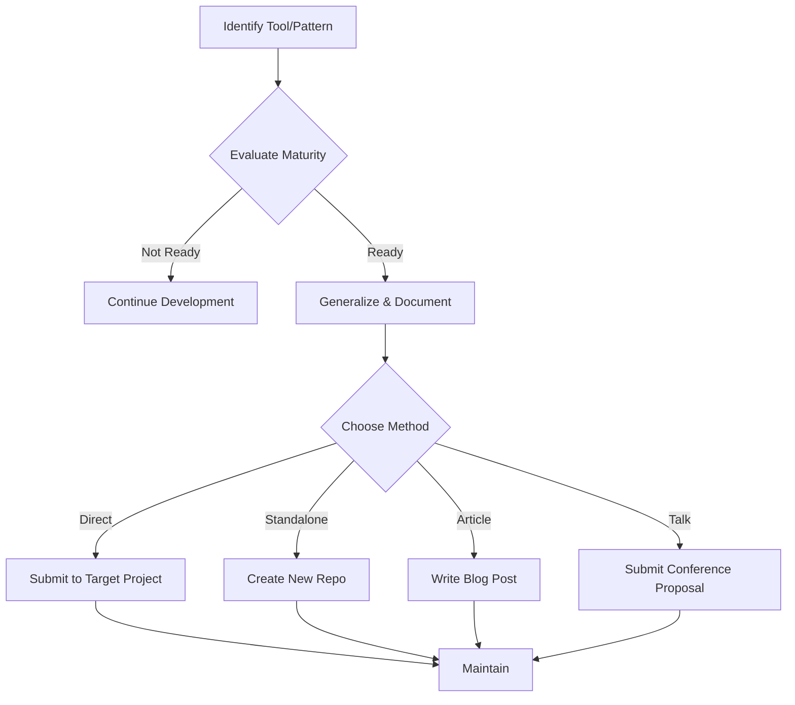

# Retro-Contribution Guide

> **Audience**: All Contributors, Open Source Maintainers  
> **Issue**: #56

## Purpose

This guide explains how to contribute patterns, tools, and workflows developed in `trading-bot-open-source` back to the community. Retro-contribution helps other projects benefit from our solutions while strengthening the open source ecosystem.

## What is Retro-Contribution?

**Retro-contribution** is the practice of taking tools, patterns, or workflows developed within a project and contributing them back to:
- Other open source projects
- The broader community
- Upstream dependencies
- Related ecosystems

It's the **reverse flow** of typical contribution: instead of taking from the community and giving back to the same project, we share our innovations across multiple projects.

## Why Retro-Contribute?

### Community Benefits
- **Knowledge Sharing**: Helps other projects solve similar problems
- **Ecosystem Growth**: Strengthens the entire open source ecosystem
- **Best Practices**: Spreads proven patterns and approaches
- **Collaboration**: Creates opportunities for cross-project collaboration

### Project Benefits
- **Visibility**: Increases project recognition in the community
- **Quality**: External use of tools improves their quality through feedback
- **Maintenance**: Shared tools may receive contributions from other projects
- **Recruitment**: Demonstrates thought leadership and attracts contributors

## What to Retro-Contribute

### 1. Documentation Patterns

**Examples from Our Project**:
- YAML front matter metadata schema
- Domain-based documentation structure
- AI agent documentation guidelines
- Documentation validation workflows

**Good Candidates**:
- ✅ Proven patterns used successfully for 3+ months
- ✅ Generalizable to other projects
- ✅ Well-documented with examples
- ✅ Not project-specific business logic

### 2. Development Tools

**Examples from Our Project**:
- `generate_index.py` - Documentation index generator
- `generate_index_v2.py` - Recursive index generator with Jinja2
- `validate_docs_metadata.py` - Metadata validation script
- Pre-commit hooks configuration
- Makefile patterns for common tasks

**Good Candidates**:
- ✅ Solves a common problem
- ✅ Minimal dependencies
- ✅ Easy to adapt
- ✅ Has tests

### 3. CI/CD Workflows

**Examples from Our Project**:
- Documentation validation workflow
- Metadata validation in PRs
- Automated index generation
- Pre-commit integration

**Good Candidates**:
- ✅ Reusable GitHub Actions
- ✅ Generic validation patterns
- ✅ Well-commented YAML
- ✅ Configurable for different projects

### 4. Architecture Patterns

**Examples from Our Project**:
- Microservices structure
- Domain-driven documentation organization
- FastAPI service patterns
- Database migration workflows

**Good Candidates**:
- ✅ Battle-tested in production
- ✅ Solves common architecture challenges
- ✅ Framework/language agnostic concepts
- ✅ Documented with diagrams and examples

## How to Retro-Contribute

### Step 1: Identify What to Share

**Evaluation Criteria**:
1. **Maturity**: Is it stable and proven?
2. **Generality**: Is it useful to other projects?
3. **Documentation**: Is it well-documented?
4. **Independence**: Can it work standalone?
5. **Maintenance**: Can we maintain it externally?

**Assessment Questions**:
- Has this been used successfully for at least 3 months?
- Would other projects benefit from this?
- Is it documented well enough for external use?
- Does it have minimal coupling to our project-specific code?
- Are we willing to support it externally?

### Step 2: Prepare for Sharing

**For Tools/Scripts**:
1. **Extract**: Create standalone version
2. **Generalize**: Remove project-specific code
3. **Document**: Add comprehensive README
4. **Test**: Add unit tests
5. **License**: Ensure proper licensing

**For Patterns/Approaches**:
1. **Document**: Write detailed guide
2. **Examples**: Provide concrete examples
3. **Benefits**: Explain advantages
4. **Trade-offs**: Document limitations
5. **Alternatives**: Mention other approaches

### Step 3: Choose Contribution Method

#### Option A: Direct Project Contribution

**Best For**: Tools that fit into existing projects

**Process**:
1. Find target project (related ecosystem)
2. Check contribution guidelines
3. Open issue proposing contribution
4. Submit pull request
5. Work with maintainers on integration

**Example**: Contributing our FastAPI service patterns to FastAPI documentation

#### Option B: Separate Repository

**Best For**: Standalone tools/libraries

**Process**:
1. Create new repository
2. Extract and generalize code
3. Add comprehensive documentation
4. Publish to package registry (PyPI, npm, etc.)
5. Announce to community

**Example**: Publishing `generate_index` as standalone documentation tool

#### Option C: Blog Post / Article

**Best For**: Patterns, approaches, architecture

**Process**:
1. Write detailed article
2. Include code examples
3. Provide GitHub gist/repo link
4. Publish on community platforms
5. Share on social media

**Example**: Blog post on domain-driven documentation structure

#### Option D: Conference Talk / Workshop

**Best For**: Complex patterns, architecture decisions

**Process**:
1. Submit talk proposal
2. Create presentation
3. Provide code samples
4. Record and publish
5. Write companion blog post

**Example**: Talk on microservices observability patterns

### Step 4: Attribution and Licensing

**Always Include**:
- Original project name and link
- Original contributors
- License information (MIT, Apache, etc.)
- Link back to source implementation

**Example Header**:
```markdown
# Documentation Index Generator

Originally developed for [trading-bot-open-source](https://github.com/realisonsdotcom/trading-bot-open-source)

Contributors: [List contributors]
License: MIT
```

### Step 5: Maintain and Support

**Ongoing Responsibilities**:
- Respond to issues and questions
- Review pull requests
- Update documentation
- Release new versions
- Keep in sync with source project (if applicable)

## Retro-Contribution Workflow



## Examples from Our Project

### Example 1: Documentation Index Generator

**What**: Script to auto-generate INDEX.md files from YAML metadata

**Why**: Many projects struggle with documentation indexing

**How Shared**:
1. Created standalone version (`generate_index_v2.py`)
2. Documented in comprehensive guide
3. Added to `7_standards/retro-contribution-rbok-tooling.md`
4. Ready for PyPI publication

**Impact**: Can benefit any project with structured documentation

### Example 2: Domain-Driven Docs Pattern

**What**: Organizing documentation by business domains

**Why**: Scales better than feature-based organization

**How Shared**:
1. Documented pattern in guides
2. Explained in DOCUMENTATION-GUIDE-FOR-AGENTS.md
3. Shared approach on community forums

**Impact**: Several projects have adopted similar structure

### Example 3: AI Agent Guidelines

**What**: Documentation standards for AI coding assistants

**Why**: AI agents need structured, machine-readable docs

**How Shared**:
1. Published AGENTS.md with guidelines
2. Created metadata schema
3. Shared on AI/ML communities

**Impact**: Referenced by other projects building AI-friendly docs

## Best Practices

### ✅ Do

- **Document thoroughly**: Assume external users have no context
- **Provide examples**: Show real-world usage
- **Test independently**: Verify it works outside our project
- **Maintain actively**: Respond to issues and questions
- **Credit contributors**: Acknowledge all contributors
- **Keep it simple**: Make it easy to adopt

### ❌ Don't

- **Share immature tools**: Wait until proven stable
- **Include secrets**: Remove API keys, credentials
- **Over-couple**: Avoid dependencies on our project
- **Abandon**: Don't share if you can't maintain
- **Claim exclusivity**: Acknowledge similar solutions
- **Ignore feedback**: Listen to community input

## Community Engagement

### Where to Share

**Technical Communities**:
- GitHub Discussions
- Reddit (r/programming, r/opensource, r/Python, etc.)
- Hacker News
- Dev.to
- Medium

**Social Media**:
- Twitter/X (#opensource, #python, #fastapi)
- LinkedIn (professional network)
- Mastodon (tech instances)

**Direct Outreach**:
- Email maintainers of related projects
- Comment on relevant GitHub issues
- Participate in Discord/Slack communities

### How to Announce

**Template Message**:
```markdown
# [Tool/Pattern Name]

We've developed [brief description] for our open source trading bot project.

**Features**:
- Feature 1
- Feature 2
- Feature 3

**Link**: [GitHub/Blog URL]

Feedback and contributions welcome!

Originally developed for: [project link]
License: [license]
```

## Measuring Impact

### Metrics to Track

**Quantitative**:
- Stars/forks on shared repositories
- Downloads (PyPI, npm, etc.)
- GitHub issues/PRs on shared repos
- Blog post views/shares
- Conference talk attendees

**Qualitative**:
- Feedback from other maintainers
- Adoption by other projects
- Community discussion quality
- Feature requests and use cases
- Testimonials and case studies

### Success Indicators

✅ **High Impact**:
- Multiple projects adopt the tool/pattern
- Active community contributions
- Positive feedback from users
- Cited in other projects' documentation

✅ **Medium Impact**:
- Several downloads/stars
- Some community engagement
- Occasional questions/issues
- Referenced in blog posts

✅ **Growing Impact**:
- Steady usage growth
- Increasing community interest
- Feature requests indicate real-world use
- Other projects express interest

## Getting Started

### Quick Checklist

For your first retro-contribution:

- [ ] Identify one tool/pattern that worked well
- [ ] Verify it's been stable for 3+ months
- [ ] Extract and generalize the code
- [ ] Write comprehensive README
- [ ] Add examples and usage guide
- [ ] Choose contribution method
- [ ] Share with community
- [ ] Commit to maintenance

### Need Help?

**Resources**:
- See [Retro-Contribution Tooling Guide](../7_standards/retro-contribution-rbok-tooling.md) for technical details
- Check [CONTRIBUTING.md](../../../CONTRIBUTING.md) for project guidelines
- Ask in GitHub Discussions

**Questions?**:
- Open an issue with `[retro-contribution]` tag
- Ask in community channels
- Contact project maintainers

## Related Documentation

- [Retro-Contribution Tooling Guide](../7_standards/retro-contribution-rbok-tooling.md) - Technical implementation details
- [Codex Automation Platform](../7_standards/codex.md) - Advanced automation platform
- [Community Index](INDEX.md) - Community domain overview
- [CONTRIBUTING.md](../../../CONTRIBUTING.md) - Contribution guidelines

## References

- **Original Issue**: #56 - Retro-contribution guide
- **Related Issue**: #55 - Retro-contribution tooling guide
- **Philosophy**: Give back to the community that supports us

---

**Remember**: Retro-contribution is about **sharing knowledge**, not just code. Every tool, pattern, or approach we share makes the entire ecosystem stronger. 🌱

**Last Updated**: 2026-01-07  
**Maintained By**: Trading Bot Community
